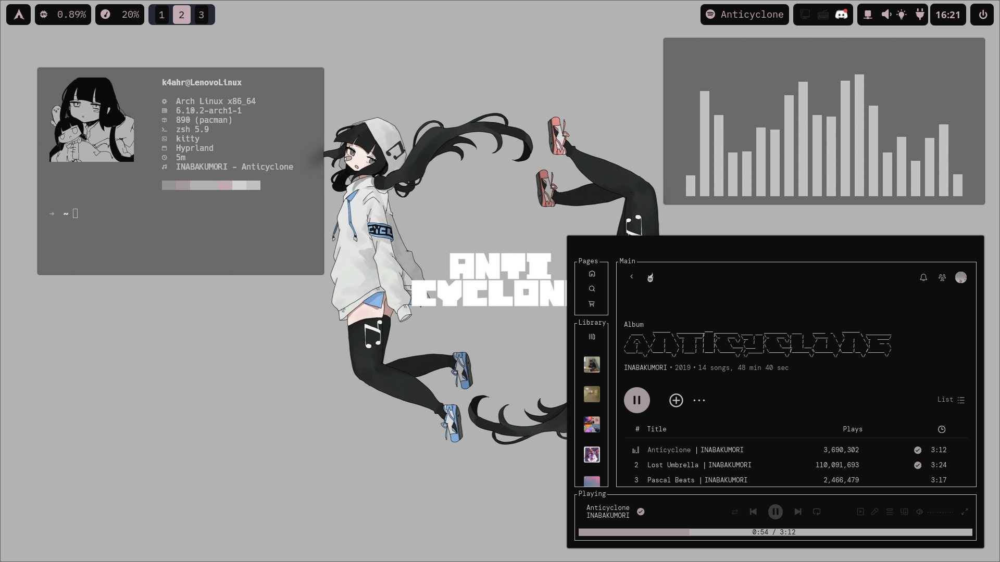
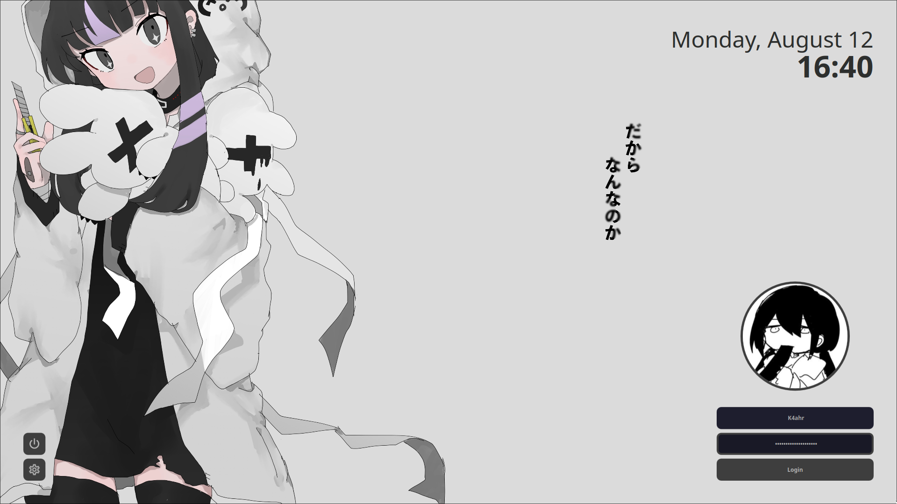
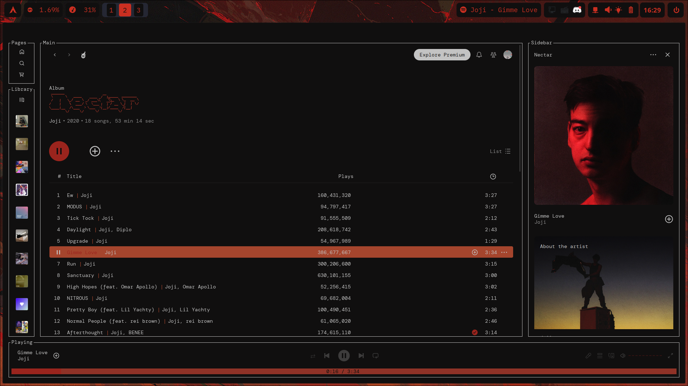
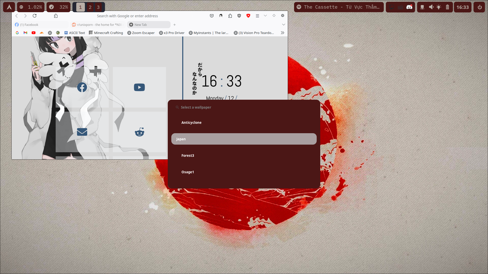
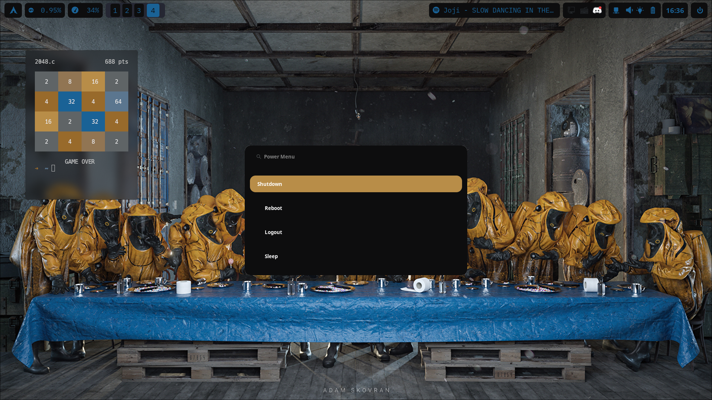
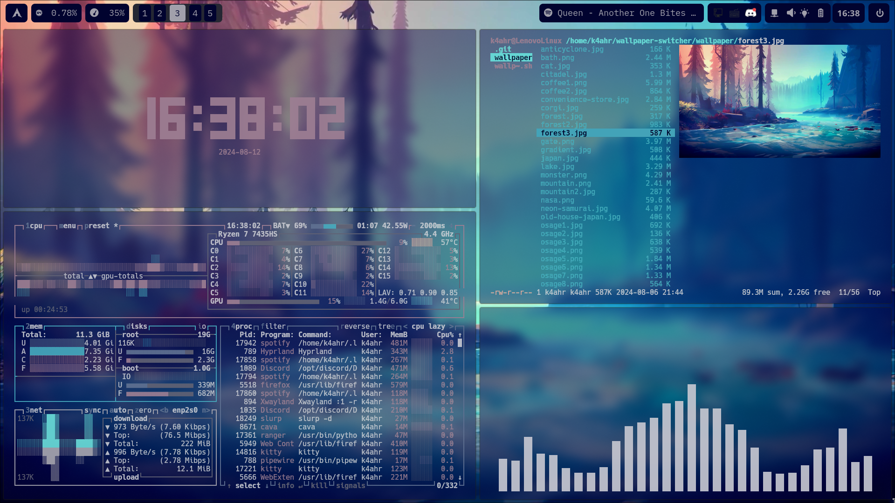
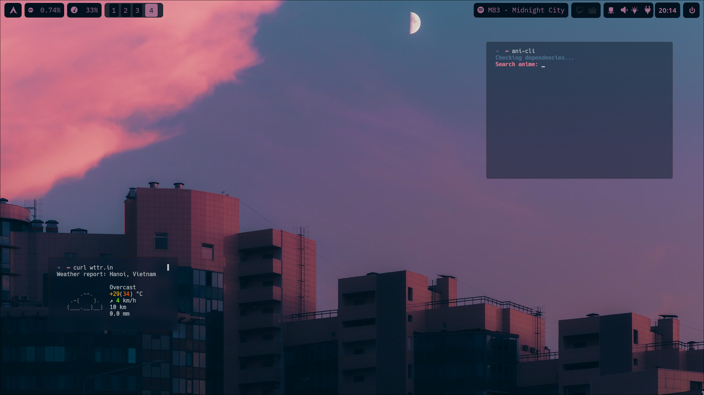
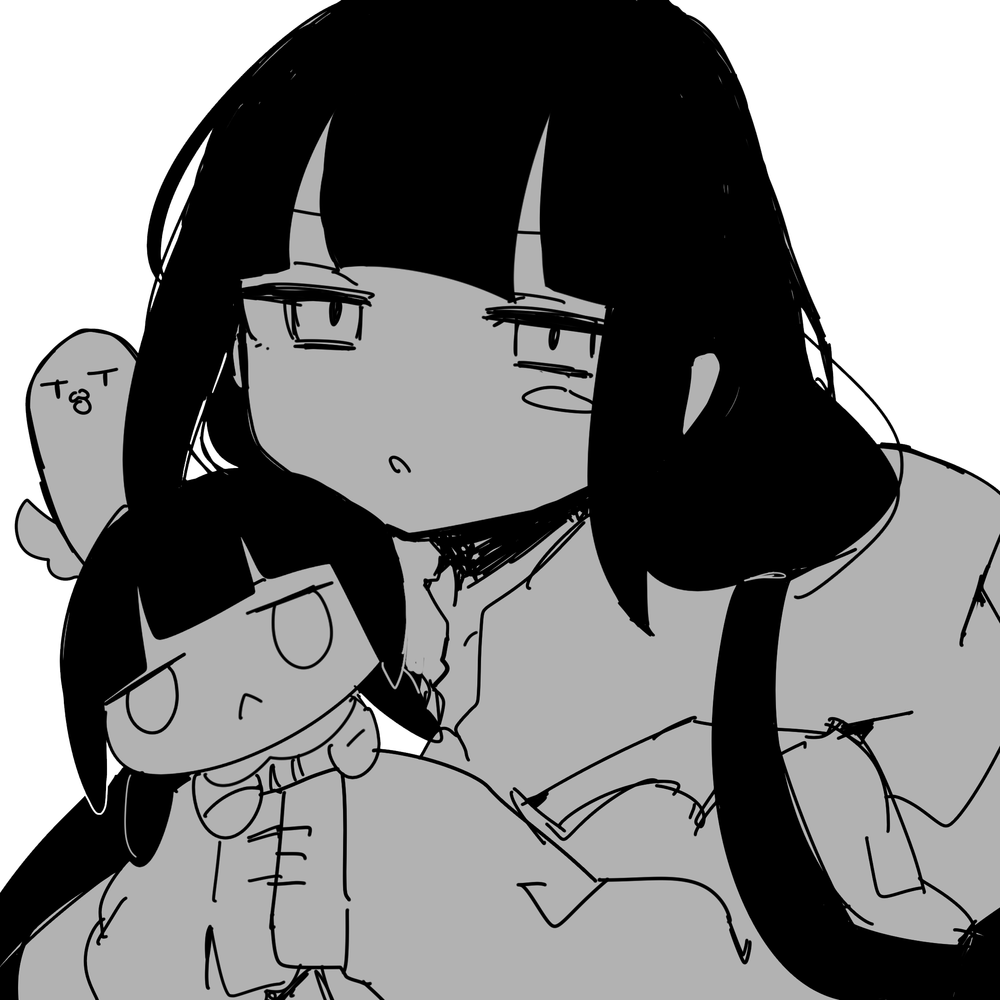

# DaoVuong's rice

> 🗃️ K4ahr's Hyprland dotfiles. 

</img>
## Screenshots

</img>
</img>
</img>
</img>
</img>
</img>


## Dependencies


| Component           | Resource  
| :---------          | :-------  
| Window Manager      | [hyprland](https://github.com/hyprwm/Hyprland)
| Color theme         | [pywal16](https://github.com/eylles/pywal16)
| Terminal emulator   | [kitty](https://github.com/kovidgoyal/kitty)
| File manager   | [ranger](https://github.com/ranger/ranger)
| Shell               | [zsh](https://github.com/ohmyzsh)
| Fetch displayer     | [neofetch](https://github.com/dylanaraps/neofetch)
| Resource monitor    | [btop](https://github.com/aristocratos/btop)
| Bar                 | [waybar](https://github.com/Alexays/Waybar)
| Lockscreen          | [sddm](https://github.com/sddm/sddm)
| Idle daemon         | [hypridle](https://github.com/hyprwm/hypridle)
| App launcher        | [wofi](https://hg.sr.ht/~scoopta/wofi)
| Wallpaper daemon    | [swww](https://github.com/LGFae/swww)
| Screenshot tool     | [hyprshot](https://github.com/Gustash/Hyprshot)
| Main Font           | [Noto Sans](https://archlinux.org/packages/extra/any/noto-fonts/) & [Nerd Font](https://github.com/ryanoasis/nerd-fonts)
| SDDM font           | [Atkinson Hyperlegible](https://archlinux.org/packages/extra/any/ttf-atkinson-hyperlegible/)
| SDDM font           | [Hack Nerd Fonts](https://archlinux.org/packages/extra/any/ttf-hack-nerd/)
| Audio visualizer    | [cava](https://github.com/karlstav/cava)
| Terminal clock      | [tty-clock](https://github.com/xorg62/tty-clock)

## Installation

### Using quick script
Installation script is still WIP :(

### Manually
* Install all listed dependencies above, with also  [git](https://github.com/git/git):
* Clone the dotfiles
```bash
$ git clone https://github.com/k4ahr/dotfiles.git
```
* Copy files to the corresponding folders
```bash
$ cp -rf dotfiles/* ~/
```
* Copy SDDM theme for the login screen
```bash
$ sudo cp -rf dotfiles/sddm-theme /usr/share/sddm/themes/
```
* Create a `theme.conf` file in `/etc/sddm.conf.d/` with the following contents:
```conf
[Theme]
Current=sddm-theme
```


## Credits


 - [Osage and her wallpapers's artist](https://x.com/nknk_ngrms)
 - [SDDM original corner theme](https://github.com/aczw/sddm-theme-corners)
 - [My Wallpaper Switcher ](https://github.com/k4ahr/wallpaper-switcher)
 - [Other Wallpapers from r/wallpaper](https://www.reddit.com/r/wallpaper/) 
